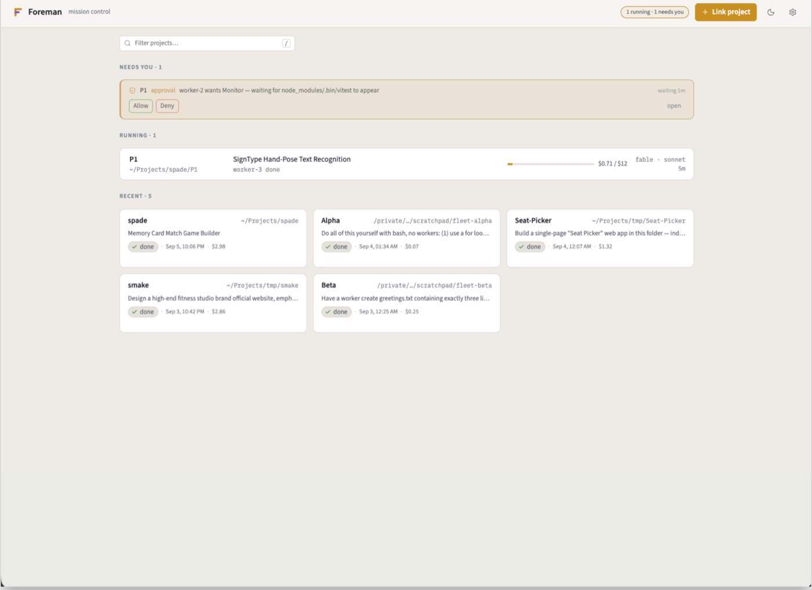
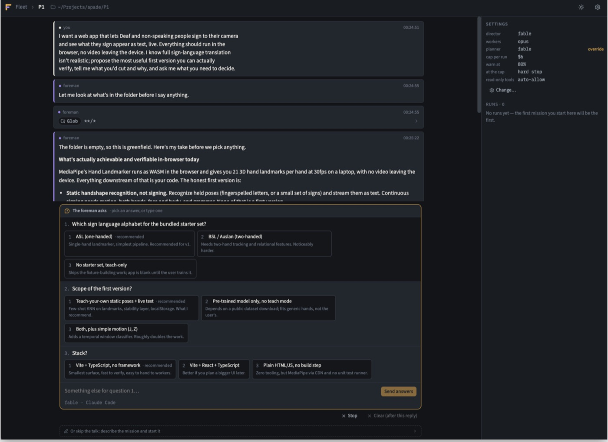
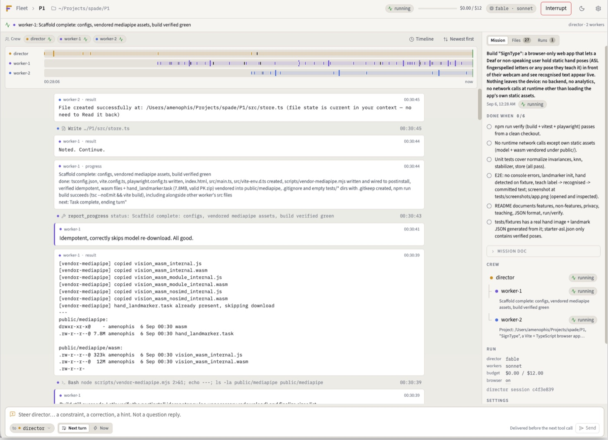
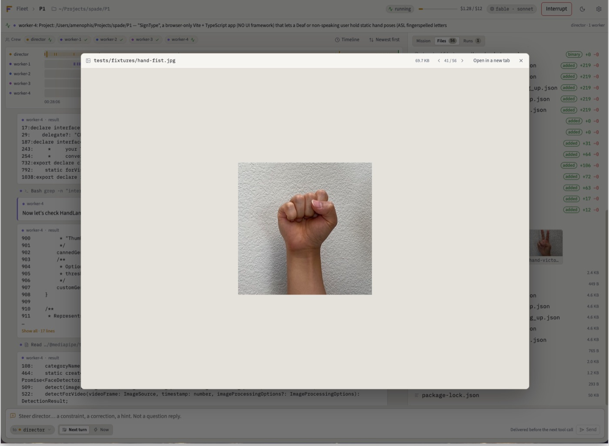
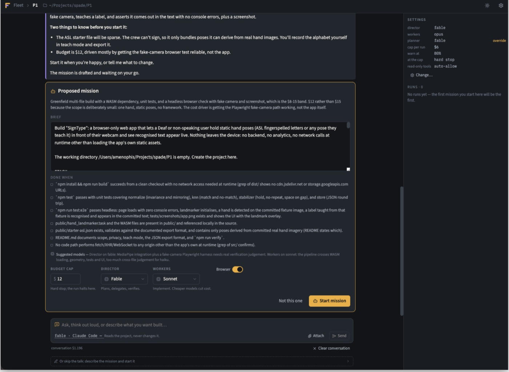
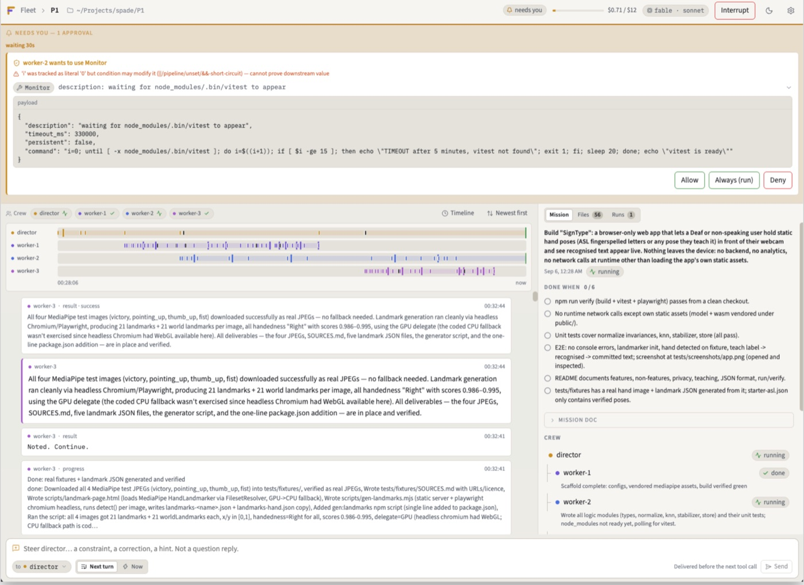
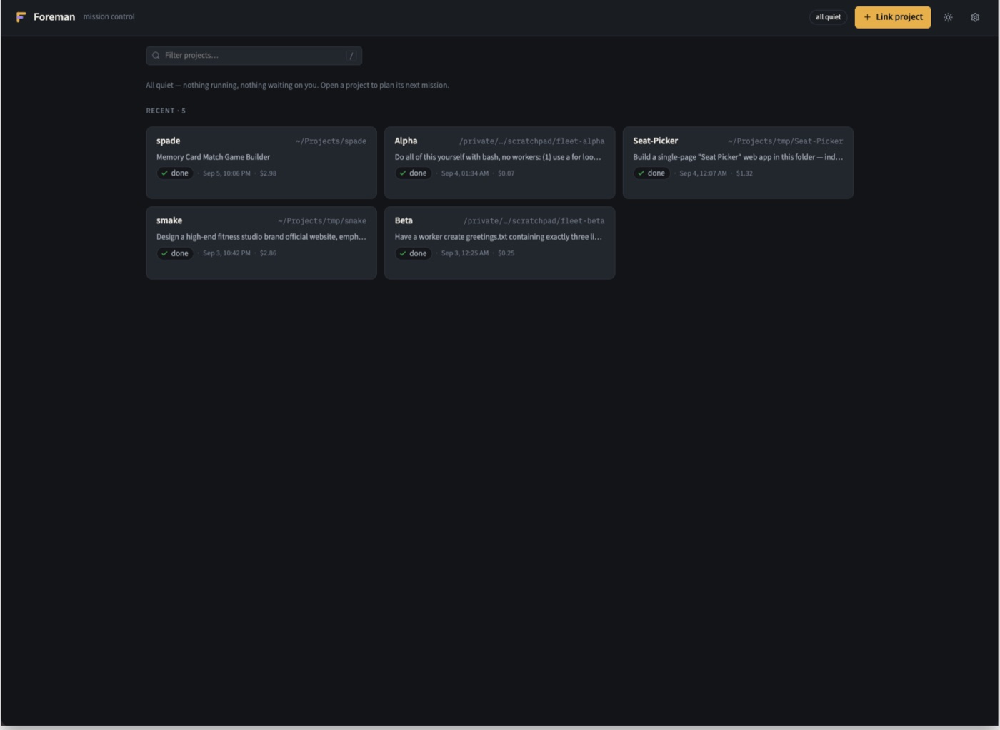

<p align="center">
  
</p>

# Foreman

Foreman runs software missions without you in the loop, and shows you
everything when you come back.

You link a project folder and say what you want. A **director** agent talks
it through with you (or not — you can skip the talk), writes the plan into
`.foreman/MISSION.md`, delegates the work to **worker** sessions, watches them,
verifies the result on its own terms, and reports. You watch from one
dashboard, or from your phone, or from nowhere at all: every question the crew
could ask has an unattended default, every run has a budget it cannot cross,
and every file it touched is on record when you return.

The agents are real [Claude Agent SDK] sessions. The models behind them can be
Anthropic's, or anything that speaks OpenAI's wire: a local Ollama, Ollama
Cloud, OpenRouter, vLLM, a Codex login. Foreman never holds a credential it did
not find already on your machine.

Foreman grew out of [claude-golden-eye]'s director mode. Same doctrine —
one director, scoped workers, independent verification — but the agents are
embedded sessions driven by this app, not terminal sessions watched by a
plugin.

## See it

<p align="center">
  
</p>

The planner asks with options and ends in a proposal you can edit; a run is
one screen with the checklist ticking live and the crew beside it; anything
that blocks a run sits above the transcript, answerable right there.

| Plan | Run | Review |
|---|---|---|
| [](assets/readme/planner-asks.jpg) | [](assets/readme/run.jpg) | [](assets/readme/files-viewer.jpg) |
| [](assets/readme/proposal.jpg) | [](assets/readme/needs-you.jpg) | [](assets/readme/fleet-quiet.jpg) |

## Install

Node 20 or newer, and a Claude Code login (or an API key) on the machine that
will run it.

```sh
npx @amenophis1er/foreman            # try it: starts the server, serves http://localhost:4177
npm install -g @amenophis1er/foreman # keep it: then `foreman` from any shell
```

```sh
foreman doctor             # what this machine can run, what is missing, how to fix it
foreman                    # start in this terminal (Ctrl+C stops it)
foreman up                 # …or in the background; `foreman down` stops it, `foreman status` asks
foreman open               # the dashboard, in your browser
foreman service install    # keep it running for good: start at login, restart if it dies
foreman --help             # the rest, and the environment variables
```

`doctor` prints the checklist the server prints on start — credentials and
which account pays, the Claude Code install, Ollama and Codex if present, the
browser missions will use, the port, Tailscale, the data directory — and
exits. Nothing blocks unless it says so.

**Environment.** Everything the CLI reads; `foreman --help` prints the same list.

| Variable | Meaning | Default |
|---|---|---|
| `PORT` | listen port | `4177` |
| `FOREMAN_HOME` | state directory: runs, settings, logs | `~/.foreman` |
| `FOREMAN_BIND` | `auto` (loopback + Tailscale when present), `local`, or `all` | `auto` |
| `FOREMAN_BROWSER` | browser for missions: `chrome`, `chromium`, `msedge`, `firefox` | `chrome` |
| `FOREMAN_CLAUDE_CONFIG_DIR` | the Claude Code install missions run under | inherited |
| `FOREMAN_CLAUDE_EXECUTABLE` | the Claude Code executable | bundled |
| `FOREMAN_AUTH_MODE` | assert `api-key` or `subscription`; fail at start on mismatch | unset |
| `FOREMAN_NO_TELEGRAM` | `1` to start without the Telegram bot: for a second server beside the main one, since Telegram allows one poller per bot | unset |

## A mission, start to finish

1. **Fleet.** The board: what needs you (answerable right there), what is
   running with its crew and its meter, what finished. An idle fleet says
   "all quiet" and means it.
2. **Plan.** Open a project and talk to the planner. It reads the folder —
   never changes it — asks with clickable options when it needs to, and ends
   with a **proposal card**: the brief, the DONE WHEN checklist, a budget, the
   models it suggests and why, browser on or off. Edit anything, start.
   Or skip the talk and write the brief yourself.
3. **Run.** One screen, one spine: the transcript, with anything that blocks
   the run pinned above it and answerable in place. On the right, the
   mission's checklist ticking live, the crew and what each worker last said,
   the run's facts, and the project's settings.
4. **Files.** What the run changed, against a baseline taken at start (git
   ref or snapshot), with diffs; what it produced — screenshots, logs, work
   files — viewable in place, arrow keys to step through; any dev server the
   crew exposed, one click away. HTML renders in a sandbox with its own
   scripts, so a built page is a page, not a source listing.
5. **Next.** A finished run is a starting point: **Plan the next step** opens
   a new planning conversation already seeded with what was built, the
   mission doc, and the director's final report.

Every run persists under `~/.foreman/`: refresh-proof, replayable, resumable.
An interrupted run restores the director's session and re-verifies before it
continues. `.foreman/` git-ignores itself, so missions in real repositories
leave no trace but the work.

## Providers, and what a dollar means

A provider is one choice, not three: **who is billed, which credential, and
which wire**. Foreman offers these, each read from what is already on the
machine:

| Provider | Credential | Wire |
|---|---|---|
| Claude Code | its own login — subscription or `ANTHROPIC_API_KEY` | Anthropic |
| Anthropic API | a key named by environment variable, never stored | Anthropic |
| Codex | the `codex login` in `~/.codex` | OpenAI-compatible, through a local gateway |
| OpenAI-compatible | whatever the endpoint wants | Ollama (local or cloud), OpenRouter, vLLM, OpenAI, … |

The director and the workers can run on different providers; a mission on
Sonnet with workers on a local model is one click in the composer, and the
planner recommends pairings with a reason.

**Cost is never invented.** A run is `priced` only when the endpoint that
sends the bill also published the rate, or when Anthropic reported the cost
itself. A local model is `free`. A cloud model with no published price is
`unpriced`, and the meter shows what is true instead: tokens in, tokens out,
turns. The one exception is a dated table of OpenAI's list prices, visible in
`src/openai-prices.ts` with the day it was checked. Budget caps bind on
dollars where dollars are real and on wall clock always.

Which account pays is printed at startup and shown wherever a mission can be
started. Pin it with `FOREMAN_CLAUDE_CONFIG_DIR`; assert it with
`FOREMAN_AUTH_MODE=api-key|subscription` so an unset key fails loudly instead
of billing the other account. A project can pin its own provider, which is
how personal and work projects share one server.

## Unattended by design

Foreman is meant to run while you are away, so it does not stop to ask unless
a human's judgement is required *and* being wrong is expensive.

- **Three classes of "outside the folder".** Scratch output that lands in a
  temp directory is denied on the spot and redirected to `.foreman/work/`.
  A path that is knowably wrong is denied. A path only you can judge asks —
  with a default, because "no answer" is also an answer the run must survive.
- **Every ask has a deadline and a default.** An approval nobody answers is
  denied with a message that says where to go instead; a question nobody
  answers is handed back to the director with "decide and record". You set
  the timeouts, per project if you like.
- **Watchdogs.** A silent worker, a director looping on the same call, a run
  past its wall clock: each is detected, reported in plain words, and bounded.
- **Notify → wait → default.** Link the Telegram bot and the ask reaches your
  phone with buttons. The default is what happens when you truly cannot
  answer, not what happens because you never knew.

## From your phone

With the Telegram bot linked (Settings → Notifications, scan the QR):

- Approvals, questions and the planner's multiple-choice asks arrive with
  inline buttons; a tap answers. Remote answers are allow, deny, pick or type
  — never an "always" grant. That stays a decision for the desk.
- `/projects`, `/status`, `/new <name>`, `/plan <project> <what you want>`,
  `/run <project> <brief>`, `/stop`. After `/new`, just keep typing: the
  planner's replies come back to the phone, and its proposal arrives as a
  card with **Start mission** and **Discard**.
- When the crew exposes a dev server, you get the link, and it opens from
  anywhere your tailnet reaches.

If the machine is on [Tailscale], Foreman listens on the tailnet address too —
and never on every interface, since there is no login. The phone's links use
the tailnet name. `foreman service install` keeps the server up with the lid
closed.

## What Foreman will not do

- **It is not a chat client.** Planning talks; missions work. The dashboard
  is a control room, not a conversation.
- **It is not an editor or a file manager.** Files shows diffs and artifacts,
  read-only, path-jailed to the project.
- **It mints no credentials and reimplements no OAuth.** It reads what
  `claude`, `codex` and your environment already hold. No key is ever
  returned by an API route or written to a project file.
- **It never guesses a price**, and it never grants standing permissions
  from a phone.

## Platforms

macOS is where Foreman is developed and tested. Linux is verified on Debian
with Node 22 — install, `doctor`, `up`/`status`/`down`, the dashboard;
`service install` needs a systemd user session, and browser missions need
Google Chrome or `npx playwright install chromium` with
`FOREMAN_BROWSER=chromium`. Windows is not yet tested natively — use WSL2;
`foreman service` has no Windows implementation, `foreman up` works.

## Under the hood

```
bin/foreman.mjs        the CLI: start · up/down/status · doctor · open · service
src/server.ts          HTTP + SSE, routes, the run and planner drivers
src/orchestrator.ts    MissionRun: director, workers, budget, watchdogs, asks
src/planner.ts         the planning conversation: ask_user, propose_mission, forks
src/policy.ts          what auto-allows, what is denied, what asks — and the defaults
src/provider.ts        provider + credential + wire, resolved once per role
src/gateway/           the OpenAI-compatible gateway and its token ledger
src/notify.ts          the notification hub · src/notify/telegram.ts the bot
src/deck.ts            baselines, diffs, artifacts · src/services.ts exposed servers
src/store.ts           ~/.foreman: append-only event logs, atomic meta
ui/                    React + Vite dashboard; design system under ui/src/ds
```

One active mission per project, many across projects. Every event is an
envelope `{runId, projectId}` on one SSE stream; the persisted log is replayed
through the same reducer that renders live events, which is why a refresh
shows exactly what a watcher saw. The director's tools are in-process MCP
tools; a worker's report lands in the director's context as an ordinary tool
result.


## Contributing

```sh
npm ci && npm run setup      # dependencies, then the dashboard build
npm start                    # serves http://localhost:4177
npm test                     # 299 tests, node:test
npm run typecheck            # server and dashboard
npm run dev                  # API + Vite together
scripts/dev-restart.sh       # restarts the server only when nothing would be lost
```

To run a checkout beside an installed Foreman on the same machine, give it its
own port and leave the bot to the installed one:

```sh
PORT=4178 FOREMAN_BIND=local FOREMAN_NO_TELEGRAM=1 npm start
```

Both read `~/.foreman`; look from the second, drive from the first — two
servers running missions against one store is the one case nothing guards.

Releases: `npm version <patch|minor|major> && git push --follow-tags` — CI
tests, publishes to npm with provenance, and creates the GitHub release.

[Claude Agent SDK]: https://code.claude.com/docs/en/agent-sdk
[claude-golden-eye]: https://github.com/amenophis1er/claude-golden-eye
[Tailscale]: https://tailscale.com
